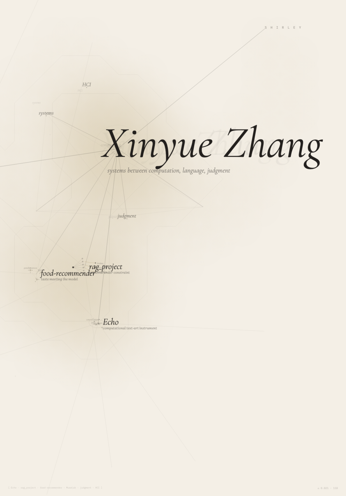

<picture>
  <source media="(prefers-color-scheme: dark)" srcset="./assets/profile-dark.png">
  <source media="(prefers-color-scheme: light)" srcset="./assets/profile-light.png">
  
</picture>

  <a href="https://github.com/cs146j-26sp/echo">Echo</a> ·
  <a href="https://github.com/xinyuezhang-shirley/MuseLab">MuseLab</a> ·
  <a href="https://github.com/xinyuezhang-shirley/rag_project">rag_project</a> ·
  <a href="https://github.com/xinyuezhang-shirley/cs278FoodRecommender">food-recommender</a> ·
  <a href="https://xinyuezhang-shirley.github.io">Portfolio</a>

